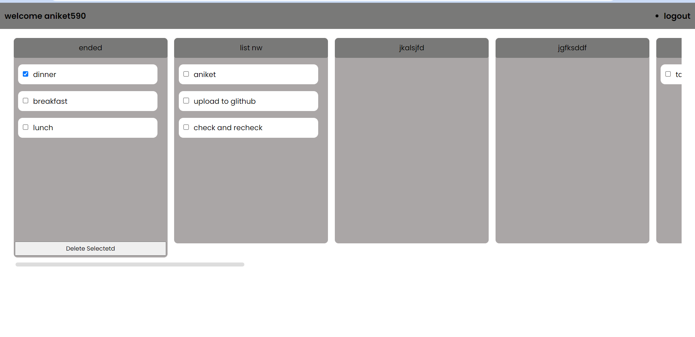

#Todo App

  
</p

Here you can create List Blogs and manage Your tasks. 

This is PERN stack project.. 

## Overview
  Task management app created with ReactJs and NodeJs.
  Users can create an account, create lists, create tasks, and delete tasks.
  User can drag and drop task from one list to another if they are not completed.

## Pre-requisites to run this project

1. Postgresql Neon database url
2. Node Js.

## Steps to run this project

1. Clone the repo
2. Run `npm install` to install all the dependencies
3. Create a `.env.local'
4. Update `.env.local`
5. Run `npm run start` to start the project

### Tech stack

- React JS
- React-icons
- Postgresql
- Sequilize
- Node JS
- Express JS

